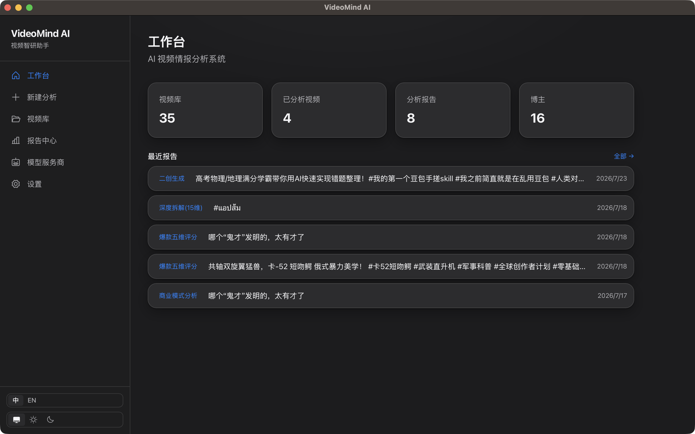
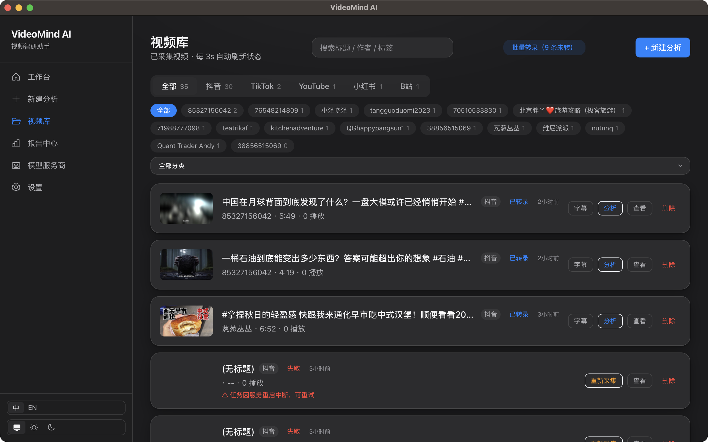
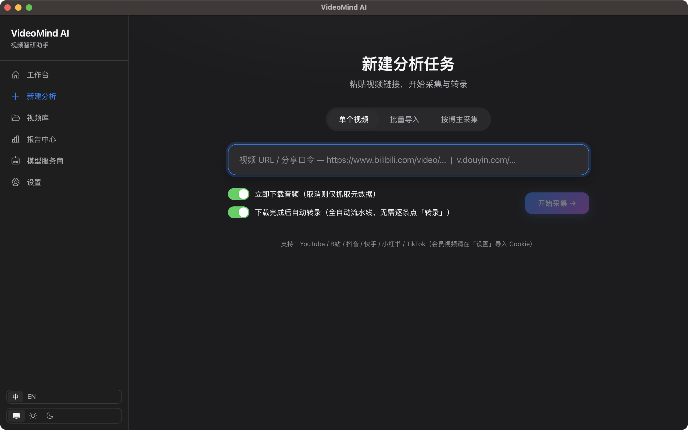

<div align="center">

# VideoMind AI

**AI 视频情报分析系统 —— 把任何视频变成结构化洞察**

[](LICENSE)
[](.github/workflows/ci.yml)
[](https://www.python.org)
[](https://tauri.app)

一款开源桌面应用：**采集**全网视频 → 本地**转录** → **AI 深度分析** → 输出**结构化报告**——你的 AI 视频研究员。

[功能](#-功能) · [快速开始](#-快速开始) · [打包桌面应用](#-打包桌面应用) · [路线图](#-路线图) · [English](README.md)

</div>

<p align="center">
  
  
  
</p>

---

## ✨ 功能

- 🎬 **采集** —— 通过 `yt-dlp` 支持 YouTube / B站 / 抖音 / 快手 / 小红书 / TikTok，批量导入 + 浏览器 Cookie 一键导入；**抖音博主主页**可在应用内浏览器自动抓取（无需手算签名）
- 🎙️ **转录（ASR）** —— 本地 `faster-whisper`（可 GPU 加速、离线运行），按时长自动选模型，导出 SRT / VTT；模型已缓存时强制离线，避免网络阻塞
- 🧠 **AI 分析** —— 多服务商路由（OpenAI / Claude / 通义千问 / DeepSeek / MiniMax / Ollama …），5 套分析模板（**内容摘要 / 关键要点 / 商业模式 / 课程拆解 / 爆款逻辑**），长视频 map-reduce 分片，支持推理模型的 `<think>` 块
- 📄 **报告** —— Markdown / PDF / HTML 导出，结构化渲染
- 🖥️ **跨平台桌面应用** —— Tauri 2（Rust）+ React，支持 macOS / Windows
- 🔒 **本地优先** —— 媒体文件、字幕、API Key 全部留在你的机器上

## 🧩 工作原理

```
链接 → yt-dlp 采集 → ffmpeg → wav → faster-whisper 转录
    → 多模型 AI 分析 → 结构化 JSON → MD / PDF 报告
```

全部跑在一个桌面应用里：Python 后端（FastAPI）作为 sidecar 被拉起，外层是 Tauri 壳。

## 🚀 快速开始（开发模式）

```bash
# 1. 后端（Python 3.11+）
cd apps/server
pip install -e ".[all]"   # = dev + llm + asr + report 全套依赖
uvicorn videomind.main:app --reload --port 18791

# 2. 前端（Node 20+）—— 另开一个终端
cd apps/desktop/web
npm install
npm run dev    # → http://localhost:1420
```

打开 <http://localhost:1420> → **模型服务商**页加一个模型（如 OpenAI 兼容端点）→ **新建分析** 粘贴视频链接 → 采集 → 转录 → 分析 → 导出 PDF。

> 需要系统装有 **FFmpeg**（作为子进程调用，不打包进应用）。

## 📦 打包桌面应用

```bash
# 把 Python 后端打包成 sidecar（含 whisper / weasyprint 原生库）
./scripts/build_sidecar.sh

# 构建 Tauri 安装包（macOS 出 .app / .dmg，Windows 出 .msi）
cd apps/desktop && npm run build
```

详见 [apps/desktop/README.md](apps/desktop/README.md)。

## ⚙️ 配置

| 项目 | 位置 |
|------|------|
| 模型服务商 | 应用内 **模型服务商** 页（OpenAI 兼容 + Anthropic，30+ 预设） |
| 平台 Cookie（会员视频） | 应用内 **设置 → 导入 Cookie** |
| 数据目录 | `~/.videomind`（可用 `VIDEOMIND_DATA_DIR` 覆盖） |

## 🗺️ 路线图 —— 开源核心（Open Core）

| 能力 | CE（本仓库，MIT） | EE（商业版） |
|------|:---:|:---:|
| 核心流水线（采集 / 转录 / 分析 / 报告 / 桌面端） | ✅ | ✅ |
| 结果查看器（播放器 + 字幕 + 报告分屏） | ✅ | ✅ |
| 国际化（中 / 英） | ✅ | ✅ |
| **知识库（RAG + 语义问答）** | — | 🔒 |
| **PPT / 思维导图导出** | — | 🔒 |
| **多模态 OCR（关键帧）** | — | 🔒 |
| **账号监控 Agent（竞品周报）** | — | 🔒 |
| **团队协作 / 私有化部署 / 开放 API** | — | 🔒 |

核心永久免费，企业能力反哺开发。详见 [docs/OPEN_CORE_STRATEGY.md](docs/OPEN_CORE_STRATEGY.md)。

## 📚 文档

- [PRD（产品需求）](docs/PRD.md)
- [技术设计](docs/TECH_DESIGN.md)
- [AI 引擎设计](docs/AI_ENGINE_DESIGN.md)
- [UI 重设计](docs/UI_REDESIGN_PLAN.md)
- [V4 账号监控方案](docs/V4_ACCOUNT_MONITOR_PLAN.md)

## 🤝 贡献

欢迎为**核心**贡献代码 —— 见 [CONTRIBUTING.md](CONTRIBUTING.md) 与 [CODE_OF_CONDUCT.md](CODE_OF_CONDUCT.md)。

> 企业功能（RAG / PPT / OCR / 账号监控 / 团队）在私有商业版中开发，**不接受**向本仓库的 PR。

## 🔐 安全

见 [SECURITY.md](SECURITY.md)。漏洞请私下报告，勿通过公开 issue。

## 📄 许可证

[MIT](LICENSE) © VideoMind AI.

**第三方声明：** 依赖 [yt-dlp](https://github.com/yt-dlp/yt-dlp)、[faster-whisper](https://github.com/SYSTRAN/faster-whisper)、[FFmpeg](https://ffmpeg.org)（LGPL/GPL，作为子进程调用、不打包）、[Tauri](https://tauri.app)、[React](https://react.dev) 以及你配置的模型服务商。
